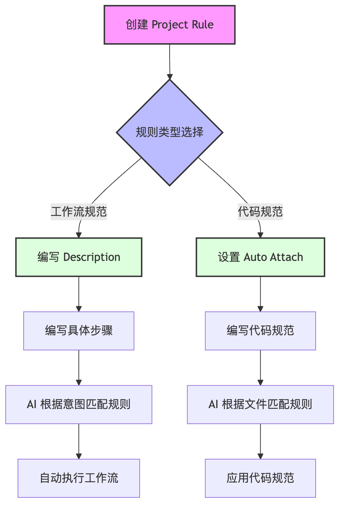

# VizForge

VizForge 是一个基于 MCP (Model Context Protocol) 的图表生成服务，旨在为各种写作和展示场景提供高质量的数据可视化解决方案。



## 项目概述

VizForge 使用 Next.js 作为官网框架，Storybook 用于组件开发和调试，并通过 MCP 服务提供图表生成功能。该项目可以帮助用户轻松创建：

- 数据分析图表（柱状图、折线图、饼图等）
- 功能对比表格
- 流程图和示意图
- 产品特性展示
- 技术架构图
- 数据仪表盘
- 时间线和进度展示
- 自定义主题的可视化内容

## 技术栈

- **前端框架**：Next.js 15
- **组件开发**：React 19
- **样式**：Tailwind CSS
- **组件调试**：Storybook 8
- **图表生成**：Puppeteer
- **MCP 集成**：@modelcontextprotocol/sdk
- **构建工具**：tsup

## 项目结构

```
VizForge/
├── .storybook/          # Storybook 配置
├── dist/                # 构建输出目录
├── mcp/                 # MCP 服务相关代码
│   ├── componentMap.ts  # 组件映射表
│   ├── Container.tsx    # 组件容器
│   ├── screenshotService.ts # 截图服务
│   └── server.ts        # MCP 服务器
├── public/              # 静态资源
├── scripts/             # 辅助脚本
├── src/                 # 源代码
│   ├── app/             # Next.js 应用
│   ├── components/      # React 组件
│   ├── stories/         # Storybook 故事
│   └── utils/           # 工具函数
└── ...
```

## 快速开始

### 安装依赖

```bash
pnpm install
```

### 开发模式

启动 Next.js 开发服务器：

```bash
pnpm dev
```

启动 Storybook 进行组件开发：

```bash
pnpm storybook
```

### 构建

构建 Next.js 应用：

```bash
pnpm build
```

构建 MCP 服务：

```bash
pnpm build:mcp
```

构建 Storybook：

```bash
pnpm build-storybook
```

### 运行 MCP 服务

构建 MCP 服务后，可以通过以下命令启动：

```bash
node ./dist/mcp/server.mjs
```

## MCP 图表生成服务

VizForge 的核心功能是通过 MCP 提供的图表生成服务。该服务允许用户通过简单的 API 调用生成各种图表和可视化内容。

### 可用工具

- `generate_chart`：生成组件的截图，可用于各种图表和可视化
- `list_components`：列出所有可用于生成图表的组件，并返回组件的参数信息

### 使用示例

生成一个简单的 HelloWorld 组件截图：

```json
{
  "componentName": "HelloWorld",
  "outputPath": "/path/to/output.png",
  "width": 800,
  "height": 600,
  "props": {
    "name": "VizForge",
    "textColor": "#3b82f6"
  },
  "darkMode": false
}
```

## 组件开发

VizForge 支持添加自定义组件以扩展图表生成能力。要添加新组件：

1. 在 `src/components/` 目录下创建新的组件文件
2. 在 `mcp/componentMap.ts` 中注册组件及其属性类型
3. 为组件创建 Storybook 故事以便于调试

## 贡献指南

欢迎为 VizForge 做出贡献！请遵循以下步骤：

1. Fork 本仓库
2. 创建您的特性分支 (`git checkout -b feature/amazing-feature`)
3. 提交您的更改 (`git commit -m 'Add some amazing feature'`)
4. 推送到分支 (`git push origin feature/amazing-feature`)
5. 打开一个 Pull Request

## 许可证

[MIT](LICENSE)

## 联系方式

如有任何问题或建议，请通过 [issues](https://github.com/acring/VizForge/issues) 联系我们。

---

这个 README 是根据项目架构和功能自动生成的。如需更多详细信息，请参考代码文档和注释。
